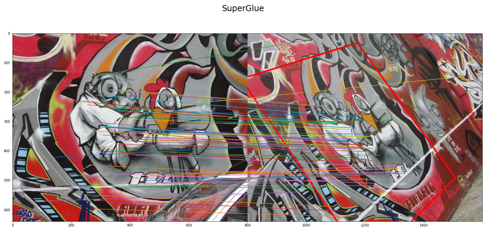

# SuperGlue

A PyTorch implementation of [SuperGlue](https://arxiv.org/pdf/1911.11763.pdf).

SuperGlue is a graph neural network that performs joint context aggregation, descriptors matching and filtering in a unified deep network architecture trained end-to-end. 
SuperGlue is made up of two major components: the Attentional Graph Neural Network and Optimal Matching Layer. 
The first component extracts matching descriptors from the input keypoints and descriptors using the graph neural network with attention mechanisms. 
The second one computes the score matrix with dustbins and finds optimal partial assignment using the Sinkhorn algorithm.

## Pretrained models
This repository provides two pretrained models:
- [SuperGlue-DoGHardNet-60000steps.pt](https://github.com/borsukvasyl/SuperGlue/blob/master/superglue/checkpoints/SuperGlue-DoGHardNet-60000steps.pt) - 
  pretrained model for keypoints detected with OpenCV SIFT (DoG detector) and HardNet descriptors
- [SuperGlue-SIFT-50000steps.pt](https://github.com/borsukvasyl/SuperGlue/blob/master/superglue/checkpoints/SuperGlue-SIFT-50000steps.pt) - 
  model pretrained on OpenCV SIFT keypoints and descriptors

Note: Both of them are trained on less than 100k iterations which is significantly lower than the official pretrained models.

## Environment setup
This code is tested with Python 3.7 in Linux. 
You can install all required packages for both training and model inference from `requirements.txt`
```shell
pip install -r requirements.txt
```

## Run demo
Navigate to the top level project directory and run
```shell
python demo.py <IMAGE0_PATH> <IMAGE1_PATH> <OUTPUT_IMAGE_PATH>
```
For example, if you run demo script with these test images:

`imgs/img0.png`            |  `imgs/img1.png`
:-------------------------:|:-------------------------:
 |  

you should get the following result:


Also, you can run SMNN matcher on the same images by passing `--do_smnn=True`.
You'll get the following results, which are much worse than SuperGlue


## Run training
You can launch training with default configuration with the following command from the project root directory:
```shell
CUDA_VISIBLE_DEVICES=0,1 PYTHONPATH="." python model_training/train.py model_training/config/train.yaml
```

You can change configuration by editing `model_training/config/train.yaml` configuration file.
For example, you can change dataset path by editing `data.image_glob` field in the configuration file.
